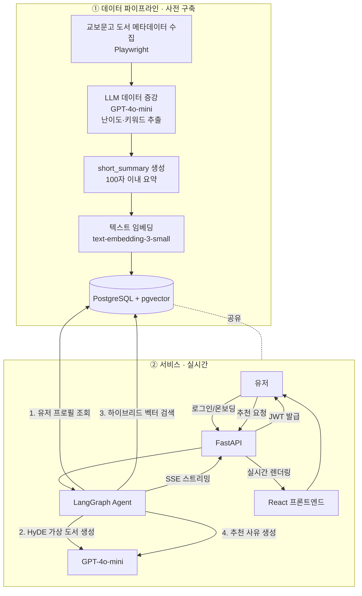
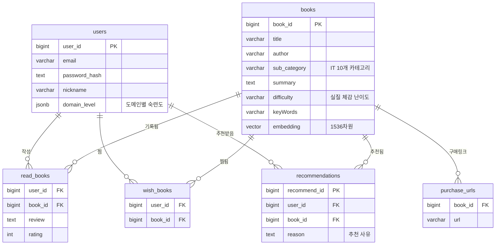

## BookFit — 나를 읽는 AI 서재

> 사용자의 도메인 숙련도와 도서의 실질적 난이도를 정밀하게 매칭하는 LLM · Agentic RAG 기반 IT 도서 추천 플랫폼

<p>
  
  
  
  
  
  
  
  
</p>

광운대학교 소프트웨어학부 졸업작품 · 팀 알잘딱깔북 · 산학협력캡스톤설계

---

##  목차

- [프로젝트 소개](#-프로젝트-소개)
- [핵심 기능](#-핵심-기능)
- [시스템 아키텍처](#-시스템-아키텍처)
- [데이터 모델 (ERD)](#-데이터-모델-erd)
- [기술 스택](#-기술-스택)
- [프로젝트 구조](#-프로젝트-구조)
- [시작하기](#-시작하기)
- [데이터 파이프라인 & 성능 평가](#-데이터-파이프라인--성능-평가)
- [팀 소개](#-팀-소개)

---

## 🎯 프로젝트 소개

### 문제 정의

정보가 넘쳐나는 시대에 "나에게 맞는 한 권"을 찾는 비용은 오히려 커지고 있습니다. 특히 학습 도서는 독자의 현재 수준에 맞지 않으면 완독률과 학습 효과가 급격히 떨어지기 때문에, 단순 인기순 추천이 아닌 수준 기반 추천의 필요성이 큽니다.

기존 도서 플랫폼의 추천 방식에는 다음과 같은 한계가 있습니다.

| 플랫폼 | 방식 | 한계 |
|---|---|---|
| 밀리의 서재 | 트래픽 기반 추천 | 개인화 성능이 낮음 |
| 알라딘 | 브랜드 기반 AI 추천 | 대화형 에이전트 없이 단순 추천에 그침 |
| 교보문고 | AI 에이전트 보유 | 온라인 웹·앱 미지원, 오프라인 한정 제공 |

### 해결 방안

BookFit은 "유저의 실력 레벨"과 "도서의 실질 난이도"를 연결하는 초개인화 매칭 플랫폼입니다.

- 유저의 학습 이력·행동을 분석해 도메인별 숙련도를 지속적으로 DB화·관리합니다.
- LLM이 도서의 실질적 난이도(출판사 마케팅 문구가 아닌 실제 체감 난이도)와 유저의 현재 레벨을 정밀 매칭합니다.
- 그 결과 단순 도서 목록이 아니라, 논리적이고 구체적인 추천 사유까지 함께 제공합니다.

### 기술적 차별점

1. 독자적 레벨링 시스템 — 단순 키워드 검색을 넘어, 유저의 리뷰·활동을 LLM으로 분석해 도메인별 숙련도를 동적으로 갱신합니다.
2. Agentic RAG 시스템 — 최신 도서 데이터를 벡터 DB(pgvector)에 저장하고, 검색 기반 생성으로 할루시네이션을 억제하며 근거 있는 답변을 제공합니다.

>  수익화 모델(알라딘·쿠팡 파트너스 제휴 링크)은 MVP 이후 확장 방향으로 검토 중입니다.

---

##  핵심 기능

- **🔍 수준 기반 도서 추천** — 유저의 도메인별 숙련도와 도서 난이도를 매칭한 개인화 추천
- **🧭 시맨틱 카테고리 라우팅** — 질의 의도를 10개 IT 세부 카테고리로 정확히 분류 후 검색 (정확도 96.7%)
- **🧠 Agentic RAG + HyDE 검색** — 가상의 이상적 도서를 생성·임베딩해 실제 도서와 유사도 매칭
- **📝 근거 있는 추천 사유** — 왜 이 책이 당신에게 맞는지 자연어로 설명
- **♻️ 비동기 유저 프로파일링** — 독후감을 백그라운드에서 분석해 숙련도를 지속 업데이트
- **❄️ 콜드 스타트 대응** — 온보딩 시 관심 장르·사전 지식 수준을 수집해 신규 유저 추천 공백 해소

---

##  시스템 아키텍처



**추천 요청 처리 흐름 (Agentic RAG)**

1. 프론트엔드 추천 요청 → FastAPI가 JWT에서 `user_id` 추출 후 LangGraph Agent 호출
2. Agent가 유저의 `domain_levels`(숙련도) 조회
3. **HyDE** — 유저 질문과 수준에 맞는 "이상적인 가상 도서"를 LLM으로 생성
4. 가상 도서를 임베딩해 pgvector에서 코사인 유사도 최상위 실제 도서 검색
5. 검색 결과 기반 추천 사유 생성 → **SSE**로 실시간 스트리밍 응답

---

## 🗄️ 데이터 모델 (ERD)



- **`users.domain_level` (JSONB)** — `{"IT/자바": 3}`처럼 도메인별 숙련도를 유연하게 저장. 개인화 추천의 핵심 데이터
- **`books.embedding` (VECTOR 1536)** — 도서 컨텍스트를 `text-embedding-3-small`로 벡터화한 값. 시맨틱 검색의 기반
- **`recommendations.reason`** — LLM이 생성한 추천 근거를 저장해 신뢰 가능한 추천 경험 제공

---

## 🛠️ 기술 스택

| 구분 | 기술 |
|---|---|
| **Language** | Python |
| **Backend** | FastAPI, SQLAlchemy 2.0, asyncpg, PyJWT, passlib |
| **AI / LLM** | OpenAI GPT-4o-mini (증강·HyDE), `text-embedding-3-small` (임베딩), LangGraph (Agent 오케스트레이션) |
| **Data Pipeline** | Playwright (크롤링), Pandas (정제) |
| **Database** | PostgreSQL + pgvector |
| **Infra** | Docker, AWS Lightsail *(배포 예정)* |
| **Frontend** *(별도 레포)* | React, Zustand, React Query, Tailwind CSS |
| **협업** | Git, GitHub |

---

## 📁 프로젝트 구조

```
BE/
├── app/                        # FastAPI 메인 백엔드
│   ├── core/                   # 전역 설정 (DB 커넥션, JWT, 의존성 주입)
│   └── domains/                # 도메인 주도 설계 (DDD)
│       ├── books/              #   ├─ router / service / schema / model
│       ├── read_books/
│       ├── recommendations/
│       └── users/
├── crawler/                    # 데이터 파이프라인
│   ├── config.py
│   ├── embedder.py             # 임베딩 생성
│   ├── data/                   # 로컬 데이터 (.gitignore)
│   ├── scripts/                # 실행 스크립트 (load_to_db.py 등)
│   └── requirements.txt
├── test/
├── docker-compose.yml          # PostgreSQL + pgvector
└── requirements.txt
```

> 각 도메인 폴더는 `router.py`(엔드포인트) · `service.py`(비즈니스 로직) · `schema.py`(Pydantic DTO) · `model.py`(SQLAlchemy 엔티티) 4계층으로 분리되어 있습니다.

---

## 🚀 시작하기

### 사전 요구사항

- Python 3.10+
- Docker & Docker Compose
- OpenAI API Key

### 1. 패키지 설치

```bash
pip install -r requirements.txt
```

### 2. 환경변수 설정

프로젝트 최상단(`app` 폴더 밖)에 `.env` 파일을 생성합니다. *(`.gitignore`에 포함 — 절대 커밋 금지)*

```env
PROJECT_NAME="BookFit API"

# API KEY
OPENAI_API_KEY="sk-proj-..."

# DB
DB_USER="root"
DB_PASSWORD="password123!"
DB_HOST="localhost"
DB_PORT=5432
DB_NAME="bookfit"
CONNECTION_POOL_SIZE=5
MAX_OVERFLOW=10

# JWT
JWT_SECRET_KEY="your-secret-key"
ACCESS_TOKEN_EXPIRE_MINUTES=10080
ALGORITHM="HS256"
```

### 3. 데이터베이스 실행 (pgvector)

```bash
docker-compose up -d
```

### 4. 서버 실행

앱 실행 시 SQLAlchemy가 엔티티를 스캔해 테이블을 자동 생성합니다.

```bash
uvicorn app.main:app --reload
```

→ API 문서: [http://localhost:8000/docs](http://localhost:8000/docs)

### 5. 데이터 파이프라인 실행 *(선택)*

크롤러는 Playwright 브라우저 바이너리가 필요합니다.

```bash
cd crawler
pip install -r requirements.txt
playwright install          # 브라우저 바이너리 설치 (필수)

# 수집 → 증강 → 임베딩 → 적재
python scripts/crawl_list.py
python scripts/crawl_detail.py
python scripts/enrich_data.py      # GPT-4o-mini 난이도·키워드 추출
python embedder.py                 # embedded_books.json 생성
python scripts/load_to_db.py       # DB 적재 (서버 + Docker 실행 상태 필요)
```

> ⚠️ 도서 데이터는 학술 목적 졸업작품 범위에서 수집되었으며, 대량 데이터셋 확보를 위해 공식 제휴를 병행 검토하고 있습니다.

---

## 🔬 데이터 파이프라인 & 성능 평가

BookFit의 추천 품질은 **양질의 도서 데이터**와 **정확한 검색 라우팅**에서 나옵니다. 이 파트는 여러 차례의 실험을 거쳐 설계를 개선했습니다.

### 데이터 현황

- **총 3,929권**의 IT 도서 수집 · 증강 완료 (3,925권 DB 적재)
- 교보문고 기준 **10개 IT 세부 카테고리**로 분류
  - 컴퓨터공학 · IT일반 · OS · 네트워크 · 보안/해킹 · 데이터베이스 · 개발방법론 · 웹프로그래밍 · 프로그래밍 언어 · 모바일프로그래밍

### 핵심 설계 결정

| 개선 | 내용 | 효과 |
|---|---|---|
| **short_summary 도입** | 줄거리가 키워드보다 지나치게 길면 키워드 신호가 벡터에 희석됨 → 100자 이내 요약으로 임베딩 | 키워드 의미 반영 강화 |
| **카테고리 제외 임베딩** | 임베딩 텍스트에서 sub_category 제거 | 난이도 신호 강화, Level Match **+10%p** |
| **시맨틱 라우팅** | 질의로부터 가상 카테고리 생성 → 10개 카테고리와 코사인 유사도 비교 → 최유사 카테고리 매핑 | 카테고리 정확도 대폭 향상 |
| **카테고리 소프트 부스트** | `cosine_distance − (매칭 시 0.15)`로 순위 보정 | 비매칭 카테고리도 의미적으로 가까우면 노출 |

### 평가 결과

3축(답변 관련성 · 카테고리 정확도 · 난이도 일치도)으로 평가하며, 30개 쿼리 기준 성능은 다음과 같습니다.

| 지표 | 기준선 | 최종 | 개선 |
|---|---|---|---|
| **카테고리 정확도** | 83.3% | **96.7%** | +13.4%p |
| **난이도 일치도** | 56.7% | **70.0%** | +13.3%p |

> 모든 평가 수치는 공식 버전 관리 CSV 기준값입니다.

---

## 👥 팀 소개

**팀명: 알잘딱깔북**

| 역할 | 담당 |
|---|---|
| **팀장 · 백엔드 · AI Lead** | 박정탁 — FastAPI 백엔드, Agent 파이프라인 |
| **프론트엔드 · AI Agent** | 이우영 — React 프론트엔드, Agent 공동 개발 |
| **데이터 파이프라인 · AI Agent** | 이주영 — 크롤링·임베딩·시맨틱 라우팅·성능 평가, Agent 공동 개발 |

**지도교수:** 최웅철 교수님

---

<p align="center">
  <sub>© 2026 알잘딱깔북 · 광운대학교 소프트웨어학부 졸업작품</sub>
</p>